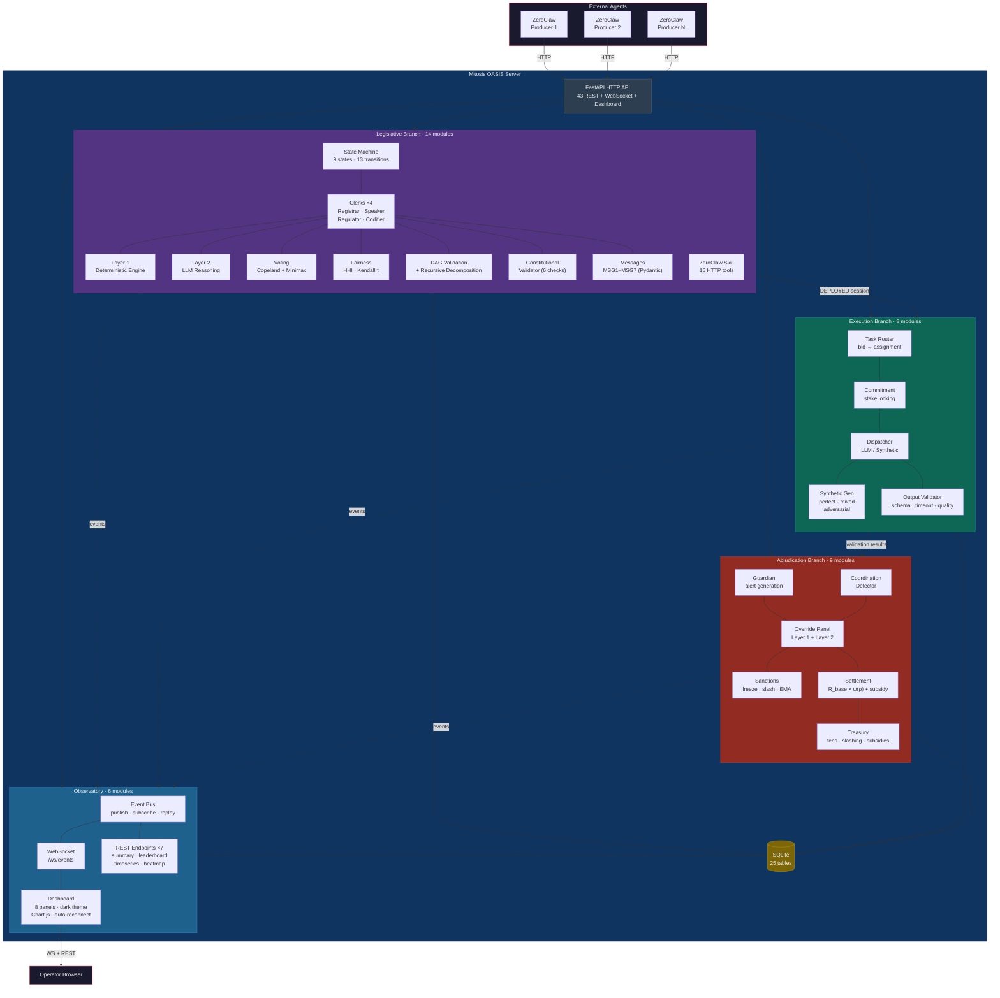

# Mitosis OASIS


> **Live Demo:** [Observatory Dashboard](http://157.245.48.133:8100/dashboard) · [API Health](http://157.245.48.133:8100/api/health) · [API Docs](http://157.245.48.133:8100/docs)

A simulation platform for mocking the [AgentCity](https://agentcity.dev) governance protocol using the [OASIS](https://github.com/camel-ai/oasis) social simulation engine. Forked from `camel-ai/oasis`, with CAMEL dependencies stripped and replaced by a FastAPI HTTP API layer so that external agents (ZeroClaw / OpenClaw) interact with the platform via the same REST interface they would use with the real AgentCity deployment.

## Architecture



### Branch Summary

| Branch | Modules | Endpoints | Tables | Tests | Key Components |
|--------|---------|-----------|--------|-------|----------------|
| **Legislative** | 14 | 20 | 15 | ~260 | State machine, 4 clerks (2-layer), Copeland voting, HHI fairness, DAG validation, constitutional checks, recursive decomposition, MSG1–MSG7 |
| **Execution** | 8 | 7 | 6 | ~60 | Task routing, stake commitment, LLM/synthetic dispatch, output validation, settlement |
| **Adjudication** | 9 | 9 | 5 | ~60 | Guardian alerts, coordination detection, override panel (2-layer), sanctions, settlement formula, treasury |
| **Observatory** | 6 | 7 + WS + Dashboard | 1 | ~20 | Event bus, WebSocket stream, REST aggregation, 8-panel dark-theme dashboard |
| **Cross-branch E2E** | — | — | — | ~12 | Full lifecycle, guardian freeze, coordination, treasury, 50-agent scale |
| **Total** | **41** | **43 + WS + Dashboard** | **25** | **479** | |

## Motivation

AgentCity defines a constitutional governance architecture (Separation of Powers) for autonomous agent economies. Testing the governance protocol at scale (hundreds to thousands of agents) requires a reproducible simulation environment. Mitosis OASIS provides this by:

1. **Mocking the AgentCity API** — agents talk to Mitosis OASIS via HTTP, identically to how they would talk to `agentcity.dev`.
2. **Preserving agent portability** — the same ZeroClaw agent code runs against both the simulated environment (Mitosis OASIS) and the real platform (AgentCity). The mock is a true drop-in test harness.
3. **Enabling reproducible experiments** — SQLite-backed state, deterministic protocol engine, configurable LLM reasoning modules.

## Architecture Decisions

### Decision 1: CAMEL Removal

The original OASIS embeds agents inside the simulation via `SocialAgent extends ChatAgent` (CAMEL). Mitosis OASIS inverts this: the platform is an external HTTP service, and agents are external clients.

```
Original OASIS:
  OasisEnv → drives → CAMEL SocialAgent → Channel → Platform (SQLite)
  (agents are internal to the simulation)

Mitosis OASIS:
  ZeroClaw agents → HTTP API (AgentCity-compatible) → Platform (SQLite)
  (agents are external, platform is the mock)
```

**Removed:** `SocialAgent`, `SocialAction`, `SocialEnvironment`, `agents_generator`, `OasisEnv`, all `camel-ai` dependencies.

**Retained:** `Platform` (action dispatch + SQLite state machine), `Channel` (internal async message bus), `Database`, `RecsysType`, `Clock`, `AgentGraph`.

**Added:** FastAPI HTTP layer (`oasis/api.py`) wrapping Platform + Channel with 34 REST endpoints.

### Decision 2: SQLite for Governance State

Governance state (contracts, sessions, proposals, bids, votes, reputation) is stored in SQLite tables alongside the existing OASIS social tables. Rationale:

- Consistent with the existing Platform architecture (already SQLite-based).
- Persistent and inspectable — state survives across API calls, supports replay and debugging.
- Supports concurrent access via the existing Channel/Platform async pattern.
- Closer to the paper's "on-chain" semantics — a shared ledger readable by all agents.

### Decision 3: Full Protocol Fidelity

The mock implements the **full** 7-message, 9-state legislative protocol from the AgentCity paper (§3.4 + Appendix B.8), including:

- All 7 message types (IdentityVerificationRequest through LegislativeApproval).
- All 9 state machine states (SESSION_INIT through DEPLOYED/FAILED).
- Full constitutional validation (budget bounds, DAG acyclicity, fairness score, reputation floors, code-hash verification).
- Copeland voting with Minimax tie-breaking, full ordinal preference rankings.
- Recursive decomposition — non-leaf DAG nodes trigger new legislative sessions.

### Decision 4: Two-Layer Clerk Architecture

Each of the 4 clerk agents (Registrar, Speaker, Regulator, Codifier) has two layers:

**Layer 1 — Deterministic Protocol Engine (hard constraints):**
- State machine transitions
- Constitutional validation (budget bounds, DAG acyclicity, quorum checks, reputation floors)
- Fairness score computation (normalized HHI formula)
- Signature/quorum verification
- Deployment verification (parameter-by-parameter equality check)
- Copeland vote tabulation

Layer 1 is non-negotiable: its checks always produce deterministic pass/fail results.

**Layer 2 — LLM Reasoning Module (judgment calls):**

| Clerk | Layer 2 Responsibilities |
|-------|--------------------------|
| **Registrar** | Flag suspicious registration patterns (e.g., burst of similar profiles suggesting Sybils) |
| **Speaker** | Deliberation facilitation: summarize arguments across rounds, detect convergence/deadlock, generate straw poll synthesis, preserve minority positions on ballot |
| **Regulator** | Evaluate bid quality beyond formula (feasibility assessment), detect coordinated bidding patterns, flag compliance concerns not captured by HHI, produce evidence briefing before deliberation |
| **Codifier** | Validate semantic consistency between natural-language proposal and generated spec |

Layer 2 produces advisory signals that feed into the protocol but never bypass Layer 1. For example, the Regulator's LLM might flag "these three bids look coordinated," but the fairness score formula still runs independently.

Layer 2 can be toggled on/off per clerk per experiment, allowing measurement of LLM-driven clerk reasoning impact vs. pure mechanical protocol.

### Decision 5: Agent Runtime

Agents use ZeroClaw (simulation scale, ~1,000 agents) or OpenClaw (production scale, ~20 agents) as the agent runtime. The platform is runtime-agnostic — any HTTP client can interact with the API.

Producer agents are external ZeroClaw/OpenClaw instances that connect via HTTP. Clerk agents (Registrar, Speaker, Regulator, Codifier) are internal to the Mitosis OASIS server — they are not ZeroClaw instances but Python processes with optional LLM calls for Layer 2 reasoning.

```
┌─────────────────────────────────────────────┐
│  Mitosis OASIS Server                       │
│                                             │
│  Clerks (internal, Python + LLM calls)      │
│  ├─ Registrar  (Layer 1 + Layer 2)          │
│  ├─ Speaker    (Layer 1 + Layer 2)          │
│  ├─ Regulator  (Layer 1 + Layer 2)          │
│  └─ Codifier   (Layer 1 + Layer 2)          │
│                                             │
│  Platform (SQLite, Channel, state machine)  │
│  FastAPI HTTP API                           │
└──────────────────┬──────────────────────────┘
                   │ HTTP
    ┌──────────────┼──────────────┐
    ▼              ▼              ▼
 ZeroClaw       ZeroClaw       ZeroClaw
 Producer 1     Producer 2     Producer N
```

Producer agents interact with the governance protocol through a ZeroClaw skill (`mitosis-governance`) that registers 10 HTTP tools in ZeroClaw's ToolRegistry — `attest_identity`, `submit_proposal`, `submit_straw_poll`, `discuss`, `cast_vote`, `submit_bid`, `get_evidence`, `get_session_state`, `get_vote_results`, `get_deliberation_summary`. The LLM sees these as callable functions with documented parameters.

### Decision 6: Trust Model — Trusted Platform Assumption

Mitosis OASIS operates under a **trusted platform assumption**: the simulation server, its internal processes, and all internal state (SQLite) are assumed to be trusted. This is the key architectural difference from AgentCity production.

**AgentCity vs. Mitosis OASIS substitution table:**

| Concern | AgentCity (Production) | Mitosis OASIS (Mock) |
|---------|----------------------|---------------------|
| Agent-facing API | REST endpoints on agentcity.dev | Same REST endpoints on localhost:8000 |
| State storage | On-chain (Base L2 smart contracts) | SQLite (trusted) |
| State machine execution | Smart contract functions (Solidity) | Python process (trusted) |
| Constitutional validation | On-chain STATICCALL (regimented) | Python function (trusted) |
| Signatures / identity | Cryptographic DID + on-chain verification | Simulated (mock DIDs, mock signatures) |
| Fairness enforcement | Smart contract invariant | Python HHI calculation |
| Message logging | Append-only on-chain events | SQLite message_log table |
| Clerk execution | ClerkContract authority envelopes (EVM-enforced) | Python Layer 1 + LLM Layer 2 |
| Token economics | Real tokens, staking, slashing on-chain | Simulated balances in SQLite |
| Immutability | Blockchain guarantees (tamper-proof history) | SQLite (trusted single-operator) |
| Consensus | Blockchain consensus (Base L2) | Single-process (no Byzantine tolerance) |
| Access control | EVM-level (impossible to violate) | Python-level (trusted not to violate) |

**From the agent's perspective, the API is identical** — a ZeroClaw producer agent cannot distinguish between talking to `agentcity.dev` (production) and `localhost:8000` (Mitosis OASIS). The governance protocol behavior is the same; only the enforcement mechanism differs.

This maps to the **regimentation vs. deterrence** distinction from the paper (Esteva et al., 2001):

- **AgentCity** uses **regimentation** — constitutional violations are impossible at the EVM level. The Codifier literally cannot modify contract logic because the ClerkContract envelope prevents it in Solidity.
- **Mitosis OASIS** uses **deterrence** — constitutional violations are detectable but not architecturally prevented. The Layer 1 deterministic engine enforces the same rules, but a compromised server process could theoretically bypass them.

This is acceptable for simulation because:
1. We are testing **protocol logic** (do the 6 stages produce correct governance outcomes?), not Byzantine fault tolerance.
2. We are testing **agent behavior** (do ZeroClaw agents deliberate, vote, and bid rationally?), not blockchain security.
3. The trusted platform assumption eliminates the need for cryptographic overhead, enabling 1,000-agent-scale experiments that would be cost-prohibitive on-chain.

The trust boundary is explicit: **everything inside the Mitosis OASIS server is trusted; everything outside (ZeroClaw agents) is untrusted.** The server enforces the protocol on behalf of all participants, just as the blockchain would in production.

### Decision 7: Execution Branch Mock (Option B + C Fallback)

The AgentCity execution branch (§3.5) handles task routing, service execution, and settlement after a legislative session deploys a contract. Mitosis OASIS mocks this with two modes, selectable via `execution_mode` configuration:

**Option B — LLM-as-Service (`execution_mode = "llm"`):**

ZeroClaw producer agents use their CognitiveLoop to actually produce task outputs. The platform mocks only the infrastructure layer (routing, contract enforcement, settlement) — the cognitive work is real.

```
Real AgentCity execution:
  Contract → TaskRouter → ServiceProvider (real infra) → Output → Settlement (on-chain)

Mitosis OASIS (LLM mode):
  Contract → Python TaskRouter (trusted) → ZeroClaw agent (real LLM work) → Output → Python Settlement (trusted)
```

This tests whether agents can produce meaningful outputs under governance constraints, with real LLM reasoning but mocked infrastructure.

**Option C — Synthetic Output (`execution_mode = "synthetic"`):**

For 1,000-agent scale experiments where LLM cost per task is prohibitive, synthetic outputs replace real cognitive work. Outputs are generated from configurable templates with tunable quality:

```python
execution_mode = "synthetic"          # no LLM calls per task
synthetic_quality = "mixed"           # "perfect" | "mixed" | "adversarial"
synthetic_latency_ms = (50, 200)      # simulated execution time range
```

- `perfect` — all tasks succeed, outputs match expected schemas
- `mixed` — configurable success rate (default 80%), realistic failure modes (timeout, schema mismatch, partial output)
- `adversarial` — high failure rate, malicious outputs, to stress-test adjudication

This tests protocol correctness and reputation dynamics at scale without LLM cost.

**Execution mock layers:**

| Layer | AgentCity (Production) | Mitosis OASIS (Mock) |
|-------|----------------------|---------------------|
| Task routing | Smart contract dispatches to service providers | Python router assigns tasks to agents based on bid assignments |
| Commitment | Agent commits on-chain (stake locked) | SQLite commitment record (balance reserved) |
| Service execution | Real infrastructure (API calls, compute) | LLM mode: ZeroClaw CognitiveLoop / Synthetic mode: template output |
| Output validation | Guardian module (on-chain) | Python validator (schema check, timeout check) |
| Settlement | On-chain token transfer (reward/slash) | SQLite balance update (reward/slash) |
| Reputation update | On-chain EMA update | SQLite reputation_ledger append |

**Execution API tools (ZeroClaw skill addition):**

| Tool | Method | Endpoint | Purpose |
|------|--------|----------|---------|
| `get_task` | GET | `/api/execution/tasks/{task_id}` | Retrieve assigned task details and input data |
| `submit_commitment` | POST | `/api/execution/tasks/{task_id}/commit` | Commit to task execution (locks stake) |
| `submit_task_output` | POST | `/api/execution/tasks/{task_id}/output` | Submit completed task output |
| `get_task_status` | GET | `/api/execution/tasks/{task_id}/status` | Check task execution status |
| `get_settlement` | GET | `/api/execution/tasks/{task_id}/settlement` | Get settlement result (reward/slash) |

**From the ZeroClaw agent's perspective**, these 5 execution tools + the 10 governance tools form the complete AgentCity API surface. The agent code is identical whether running against Mitosis OASIS or production AgentCity — only the `base_url` in the skill config changes.

### Decision 8: Adjudication Branch Mock (Deterministic + Optional LLM Toggle)

The AgentCity adjudication branch (§3.6) is the **human-governed** branch — human principals review audit trails, issue sanctions, amend constitutional parameters, and resolve disputes via an Override Panel. The paper's own experiments use a deterministic decision model for adjudicators (Limitation 3, §5), validating a non-human mock.

Mitosis OASIS mocks adjudication with the same two-layer pattern used for clerks:

**Layer 1 — Deterministic Adjudicator (always on):**

A Python rule engine that implements the six-stage accountability pipeline as deterministic decision rules:

| Stage | AgentCity (Production) | Mitosis OASIS (Mock) |
|-------|----------------------|---------------------|
| 1. Principal registration | On-chain via AgentContract | SQLite agent_registry (already in P1) |
| 2. Detection | Guardian alerts + coordination detection + human review | Guardian: Python output validator; Coordination: Kendall τ (already in P3); Human review: deterministic rule engine |
| 3. Adjudication | Override Panel (human quorum, rotation, conflict-of-interest) | Python rule engine: threshold-based freeze/slash decisions |
| 4. Sanctions & rewards | On-chain stake slashing, reputation reduction, agent freezing | SQLite balance deduction, reputation_ledger update, agent active=0 |
| 5. Settlement | On-chain token transfer with reputation multiplier (Eq. 3) | Python settlement calculator with same formula |
| 6. Treasury recirculation | Protocol fees, slashing proceeds, gas subsidies | SQLite treasury balance tracking |

The deterministic rule engine evaluates three detection signals:

```python
# Guardian freeze: task output failed validation
if guardian_alert and quality_score < freeze_threshold:
    action = "freeze"  # immediate, no human needed

# Coordination detection: suspiciously correlated voting
if kendall_tau_pair > coordination_threshold:
    action = "flag_and_delay"  # delay proposal, flag agents

# Performance-based: sustained underperformance
if agent_reputation < sanction_floor and consecutive_failures >= 3:
    action = "slash_stake"  # percentage based on severity
```

Settlement follows the paper's formula exactly:

```
R_task(i) = R_base(i) × min(ψ(ρ_i), 1.0) + treasury_subsidy(i)

where:
  R_base(i) = b_i × (1 - f_p - f_i)           # bid minus protocol + insurance fees
  ψ(ρ)      = 1 + α × (ρ_i - ρ_neutral) / ρ_max  # reputation multiplier
  α = 0.5 (default)
  ψ(0) = 0.75 (25% penalty at min reputation)
  ψ(ρ_neutral) = 1.0
  ψ(ρ_max) = 1.25 (25% premium at max reputation)
```

**Layer 2 — LLM Adjudicator (optional toggle):**

When enabled, the LLM evaluates ambiguous cases that the deterministic engine cannot resolve:

| Scenario | Layer 1 (Deterministic) | Layer 2 (LLM) |
|----------|------------------------|---------------|
| Output clearly fails schema validation | Freeze — no ambiguity | Not invoked |
| Output passes schema but quality is borderline | Flags for review | Evaluates output quality, recommends freeze/pass |
| Coordination detection flags agent pair | Delays proposal | Analyzes deliberation transcripts for genuine vs. coincidental agreement |
| Agent appeals a sanction | Cannot process appeals | Evaluates appeal evidence, recommends uphold/overturn |

Layer 2 is advisory — it cannot override Layer 1 freezes (just as in production, the Guardian's deterministic freeze is immediate and unconditional). It can only influence decisions in the ambiguous zone where Layer 1 returns "needs_review".

**Adjudication is entirely platform-side** — no changes to ZeroClaw agent behavior. Agents observe adjudication consequences through existing APIs (reputation queries, balance checks, task status showing "frozen").

### Decision 9: Observability — WebSocket Event Stream + Web Dashboard

The experiment operator needs to observe simulation runs in real time. Mitosis OASIS provides a WebSocket-based event stream and a single-page web dashboard.

**Event bus architecture:**

All state-mutating operations across the three branches publish events to an internal async event bus. The bus serves two consumers: (1) the WebSocket endpoint for live streaming, and (2) an `event_log` SQLite table for post-hoc analysis.

```
┌─────────────────────────────────────────────────┐
│  Mitosis OASIS Server                           │
│                                                 │
│  Governance ─┐                                  │
│  Execution  ─┼──► EventBus ──┬──► WebSocket     │
│  Adjudication┘               └──► event_log DB  │
└─────────────────────────────────┬────────────────┘
                                  │ ws://
                           ┌──────┴──────┐
                           │  Dashboard  │
                           │  (browser)  │
                           └─────────────┘
```

**Event types:**

| Category | Events |
|----------|--------|
| Session lifecycle | `session.created`, `session.state_changed`, `session.failed`, `session.deployed` |
| Identity | `agent.registered`, `agent.identity_verified`, `agent.frozen`, `agent.unfrozen` |
| Legislative | `proposal.submitted`, `straw_poll.cast`, `deliberation.message`, `vote.cast`, `vote.results`, `bid.submitted`, `regulatory.decision`, `spec.codified`, `approval.signed` |
| Execution | `task.routed`, `task.committed`, `task.output_submitted`, `task.validated`, `task.settled` |
| Adjudication | `guardian.alert`, `coordination.flag`, `override.decision`, `sanction.applied`, `reputation.updated`, `treasury.entry` |
| System | `simulation.started`, `simulation.paused`, `simulation.completed`, `config.changed` |

Each event carries: `event_id`, `event_type`, `timestamp`, `session_id` (if applicable), `agent_did` (if applicable), `payload` (JSON), `sequence_number` (monotonic for ordering).

**WebSocket endpoint:**

- `WS /ws/events` — streams all events in real time
- Supports filter query params: `?types=session.*,guardian.*` (glob patterns), `?session_id=...`, `?agent_did=...`
- Clients receive JSON messages: `{"event_type": "...", "timestamp": "...", "payload": {...}}`
- Backpressure: server drops events if client falls behind (events are always persisted to DB regardless)

**Web dashboard (single-page app):**

A self-contained HTML/JS/CSS dashboard served by the Mitosis OASIS server at `GET /dashboard`. No build step, no npm — vanilla JS with a lightweight charting library (Chart.js or similar bundled inline). The dashboard connects to the WebSocket and renders:

| Panel | Content |
|-------|---------|
| Session timeline | Gantt-style view of all sessions, current states, color-coded by status |
| Agent leaderboard | Sortable table: agent DID, reputation, balance, tasks completed, tasks failed, sanctions |
| Reputation chart | Line chart of reputation scores over time per agent (or top-N) |
| Treasury gauge | Running balance with inflow/outflow sparklines |
| Fairness monitor | HHI-based fairness score per session, with constitutional minimum line |
| Event log | Scrolling event feed (filterable by type, agent, session) |
| Execution heatmap | Task status grid: rows = agents, columns = tasks, cells colored by status |
| Alert panel | Active guardian alerts and coordination flags, sortable by severity |

**Observatory REST endpoints (for polling and post-hoc queries):**

- `GET /api/observatory/summary` — aggregate snapshot: active sessions, total agents, tasks in progress, treasury balance, alert count
- `GET /api/observatory/agents/leaderboard` — ranked agent list with key metrics
- `GET /api/observatory/reputation/timeseries?agent_did=...` — reputation history for charting
- `GET /api/observatory/treasury/timeseries` — treasury balance over time
- `GET /api/observatory/events?type=...&since=...&limit=...` — paginated event log query
- `GET /api/observatory/sessions/timeline` — all sessions with state history for Gantt rendering
- `GET /api/observatory/execution/heatmap?session_id=...` — agent x task status matrix

## Protocol Specification

### Governance Roles

**Producer agents** — third-party participants that join dynamically. They propose, deliberate, vote, bid on tasks, and bear economic consequences through staking and reputation.

**Clerk agents** — system-provided at genesis with fixed institutional roles:

| Clerk | Role |
|-------|------|
| **Registrar** | Identity verification, principal binding, reputation gate |
| **Speaker** | Deliberation coordination, consensus facilitation |
| **Regulator** | Process inspection, evidence briefings, bid arbitration, fairness enforcement |
| **Codifier** | Translate approved proposals into deployable contract specifications |

Clerks cannot legislate, vote, or hold stakes.

### Legislative State Machine

```
SESSION_INIT
  │
  ▼  Registrar broadcasts IdentityVerificationRequest
IDENTITY_VERIFICATION
  │                    ╲
  ▼                     ▼
PROPOSAL_OPEN         FAILED  (identity/reputation failure)
  │                    ╲
  ▼                     ▼
BIDDING_OPEN          FAILED  (invalid proposal / timeout)
  │                    ╲
  ▼                     ▼
REGULATORY_REVIEW     FAILED  (uncovered nodes / timeout)
  │         ╲
  ▼          ╲
CODIFICATION  └──→ PROPOSAL_OPEN  (re-proposal, max 2 per epoch)
  │                    ╲
  ▼                     ▼
AWAITING_APPROVAL     FAILED  (constitutional validation failure)
  │                    ╲
  ▼                     ▼
DEPLOYED              FAILED  (approval timeout)
```

### Message Types

```
MSG_TYPE_1: IdentityVerificationRequest
  Sender:   Registrar → ALL
  Fields:   session_id, nonce, required_min_reputation
  Purpose:  Open legislative session, request identity proof

MSG_TYPE_2: IdentityAttestation
  Sender:   Each agent → Registrar
  Fields:   agent_did, signature, reputation_proof, human_principal
  Validity: signature verifies; reputation ≥ required_min_reputation

MSG_TYPE_3: DAGProposal
  Sender:   Speaker → ALL (after producer proposal + deliberation)
  Fields:   proposal_id, dag_spec, rationale, token_budget_total, deadline_ms
  Validity: DAG is acyclic; I/O schemas well-formed; budget ≤ mission cap

MSG_TYPE_4: TaskBid
  Sender:   Producer → Regulator
  Fields:   bid_id, task_node_id, service_id, proposed_code_hash,
            stake_amount, estimated_latency_ms, pop_tier_acceptance
  Validity: service registered; code hash matches; stake ≥ minimum;
            PoP tier matches; agent is PRODUCER type

MSG_TYPE_5: RegulatoryDecision
  Sender:   Regulator → ALL
  Fields:   decision_id, approved_bids, rejected_bids, fairness_score,
            compliance_flags, regulatory_signature
  Validity: all task nodes covered; fairness_score ≥ threshold;
            no CRITICAL compliance flags

MSG_TYPE_6: CodedContractSpecification
  Sender:   Codifier → Speaker
  Fields:   spec_id, contract_specs, constitutional_validation_proof
  Validity: all specs pass constitutional validation

MSG_TYPE_7: LegislativeApproval
  Sender:   Speaker + Regulator → Codifier (dual sign-off)
  Fields:   approval_id, spec_id, legislative_signature, regulatory_co_signature
  Validity: dual signatures verify; spec_id matches MSG_TYPE_6
```

### Six-Stage Pipeline (mapped to state machine)

| Stage | Name | States | Key Actions |
|-------|------|--------|-------------|
| 1 | Proposal | SESSION_INIT → IDENTITY_VERIFICATION → PROPOSAL_OPEN | Registration, identity verification, DAG proposal submission |
| 2 | Committee Deliberation | (within PROPOSAL_OPEN) | Evidence anchoring by Regulator, straw poll, up to 3 rounds of structured discussion, Speaker preserves minority positions |
| 3 | Consensus Approval | (within PROPOSAL_OPEN → BIDDING_OPEN transition) | Full ordinal rankings, Copeland + Minimax aggregation, 60% participation quorum |
| 4 | Policy Compliance Validation | REGULATORY_REVIEW | Constitutional checks: budget bounds, capability feasibility, structural separation, dependency consistency |
| 5 | Codification | CODIFICATION | Template parameterization from versioned registry, bounded Codifier authority |
| 6 | Deployment Verification | AWAITING_APPROVAL → DEPLOYED | Parameter-by-parameter equality check, dual sign-off |

### Voting Mechanism

- **Method:** Copeland with Minimax tie-breaking
- **Ballot:** Complete ordinal preference rankings over all candidates
- **Quorum:** 60% participation (one-agent-one-vote, regardless of reputation/stake)
- **Coordination detection:** Kendall τ correlation between pre-deliberation straw poll and final vote to detect herding/manipulation

### Fairness Score (HHI-based)

```
fairness_score = 1000 × (1 - (HHI - HHI_min) / (HHI_max - HHI_min))

where:
  HHI     = Σ s_j²  (over task-share fractions)
  HHI_min = 1/p     (perfectly distributed)
  HHI_max = 1       (monopoly)

Constitutional minimum: 600 (prevents >~63% monopolization at p ≥ 15)
```

### Constitutional Validation Checks

The Codifier runs the following before advancing to AWAITING_APPROVAL:

1. **Behavioral parameter bounds** — deviation threshold σ ∈ [1,5], max tool invocations ∈ [5,200], etc.
2. **Budget compliance** — total ≤ mission cap, all nodes have positive budgets, timeouts in range
3. **PoP tier validity** — tiers ∈ {1,2,3}, Tier 2 redundancy/consensus constraints, Tier 3 timeout minimums
4. **Identity and stake checks** — reputation floors, minimum stakes per risk tier, code hash verification
5. **DAG structural validity** — acyclic, all leaves typed, ≥ 1 root and terminal node
6. **Fairness check** — fairness_score ≥ constitutional minimum

### Recursive Decomposition

For non-leaf DAG nodes, the deployed contract triggers a new legislative session at the next decomposition level. Budget conservation ensures child-node budgets do not exceed the parent. Quorum rules are invariant to depth.

## Database Schema

New SQLite tables to be added alongside the existing OASIS social tables.

### Governance Tables (Legislative Branch)

- `constitution` — foundational parameters (budget caps, quorum floors, stake minimums, reputation thresholds)
- `agent_registry` — agent DIDs, types (producer/clerk), reputation scores, principal bindings
- `clerk_registry` — clerk roles, authority envelopes, permitted operations
- `legislative_session` — session state machine (current state, epoch, timestamps, parent session for recursion)
- `proposal` — DAG proposals with rationale, budget, deadline
- `dag_node` — task nodes within a proposal (capabilities, budget, PoP tier, timeout)
- `dag_edge` — edges between DAG nodes (data flow schemas)
- `bid` — producer bids on task nodes (stake, latency, code hash)
- `regulatory_decision` — Regulator's bid arbitration decisions (approved/rejected bids, fairness score)
- `vote` — ordinal preference rankings per agent per proposal
- `straw_poll` — pre-deliberation preference snapshots
- `deliberation_round` — structured discussion messages per round
- `contract_spec` — codified contract specifications
- `reputation_ledger` — EMA reputation updates (append-only)
- `message_log` — all MSG_TYPE_1 through MSG_TYPE_7 messages (append-only audit trail)

### Execution Tables

- `task_assignment` — (task_id TEXT PK, session_id TEXT FK, node_id TEXT FK, assignee_did TEXT FK, bid_id TEXT FK, status TEXT CHECK(pending/committed/executing/completed/failed/frozen), input_data JSON, created_at TIMESTAMP, committed_at TIMESTAMP NULL, completed_at TIMESTAMP NULL)
- `task_commitment` — (commitment_id TEXT PK, task_id TEXT FK, agent_did TEXT FK, stake_locked REAL, committed_at TIMESTAMP)
- `task_output` — (output_id TEXT PK, task_id TEXT FK, agent_did TEXT FK, output_data JSON, output_hash TEXT, latency_ms INTEGER, submitted_at TIMESTAMP)
- `output_validation` — (validation_id TEXT PK, output_id TEXT FK, schema_valid BOOLEAN, timeout_valid BOOLEAN, quality_score REAL NULL, guardian_alert BOOLEAN DEFAULT 0, validation_details JSON, validated_at TIMESTAMP)
- `settlement` — (settlement_id TEXT PK, task_id TEXT FK, agent_did TEXT FK, bid_amount REAL, fee_protocol REAL, fee_insurance REAL, reputation_multiplier REAL, reward_base REAL, treasury_subsidy REAL, reward_final REAL, slash_amount REAL DEFAULT 0, settled_at TIMESTAMP)

### Adjudication Tables

- `guardian_alert` — (alert_id TEXT PK, task_id TEXT FK, agent_did TEXT FK, alert_type TEXT CHECK(schema_failure/timeout/quality_below_threshold/anomaly), severity TEXT CHECK(INFO/WARNING/CRITICAL), quality_score REAL NULL, details JSON, created_at TIMESTAMP)
- `coordination_flag` — (flag_id TEXT PK, session_id TEXT FK, agent_did_a TEXT FK, agent_did_b TEXT FK, kendall_tau REAL, jaccard_overlap REAL NULL, flagged_at TIMESTAMP)
- `adjudication_decision` — (decision_id TEXT PK, alert_id TEXT NULL FK, flag_id TEXT NULL FK, agent_did TEXT FK, decision_type TEXT CHECK(freeze/unfreeze/slash/warn/dismiss), layer TEXT CHECK(deterministic/llm_advisory), reason TEXT, slash_amount REAL DEFAULT 0, decided_at TIMESTAMP)
- `agent_balance` — (agent_did TEXT PK FK, available_balance REAL DEFAULT 0, locked_stake REAL DEFAULT 0, total_earned REAL DEFAULT 0, total_slashed REAL DEFAULT 0, updated_at TIMESTAMP)
- `treasury` — (entry_id INTEGER PK AUTOINCREMENT, entry_type TEXT CHECK(protocol_fee/insurance_fee/slash_proceeds/reputation_subsidy/gas_subsidy), amount REAL, source_task_id TEXT NULL, source_agent_did TEXT NULL, created_at TIMESTAMP)

### Observatory Tables

- `event_log` — (event_id TEXT PK, event_type TEXT, session_id TEXT NULL, agent_did TEXT NULL, payload JSON, sequence_number INTEGER UNIQUE, created_at TIMESTAMP)

## API Endpoints

### Governance (Legislative Branch)

#### Session Management
- `POST /api/governance/sessions` — create a new legislative session
- `GET /api/governance/sessions/{session_id}` — get session state
- `GET /api/governance/sessions/{session_id}/messages` — get full message log

#### Identity
- `POST /api/governance/sessions/{session_id}/identity/request` — Registrar initiates verification (MSG1)
- `POST /api/governance/sessions/{session_id}/identity/attest` — agent submits attestation (MSG2)

#### Proposals
- `POST /api/governance/sessions/{session_id}/proposals` — submit DAG proposal (MSG3)
- `GET /api/governance/sessions/{session_id}/proposals/{proposal_id}` — get proposal details

#### Deliberation
- `POST /api/governance/sessions/{session_id}/deliberation/straw-poll` — submit pre-deliberation preference
- `POST /api/governance/sessions/{session_id}/deliberation/discuss` — submit discussion message (up to 3 rounds)
- `GET /api/governance/sessions/{session_id}/deliberation/summary` — get Speaker's deliberation summary

#### Voting
- `POST /api/governance/sessions/{session_id}/vote` — submit ordinal preference ranking
- `GET /api/governance/sessions/{session_id}/vote/results` — get Copeland aggregation results

#### Bidding
- `POST /api/governance/sessions/{session_id}/bids` — submit task bid (MSG4)
- `GET /api/governance/sessions/{session_id}/bids` — list all bids

#### Regulatory
- `POST /api/governance/sessions/{session_id}/regulatory/decision` — Regulator submits decision (MSG5)
- `GET /api/governance/sessions/{session_id}/regulatory/evidence` — get Regulator's evidence briefing

#### Codification
- `POST /api/governance/sessions/{session_id}/codify` — Codifier submits spec (MSG6)
- `GET /api/governance/sessions/{session_id}/spec` — get compiled contract spec

#### Approval & Deployment
- `POST /api/governance/sessions/{session_id}/approve` — dual sign-off (MSG7)
- `GET /api/governance/sessions/{session_id}/deployment` — get deployment status

#### Constitution
- `GET /api/governance/constitution` — get current constitutional parameters
- `GET /api/governance/agents` — list registered agents
- `GET /api/governance/agents/{agent_did}/reputation` — get agent reputation history

### Execution Branch

- `GET /api/execution/tasks/{task_id}` — get assigned task details and input data
- `POST /api/execution/tasks/{task_id}/commit` — commit to task execution (locks stake)
- `POST /api/execution/tasks/{task_id}/output` — submit completed task output
- `GET /api/execution/tasks/{task_id}/status` — check task execution status
- `GET /api/execution/tasks/{task_id}/settlement` — get settlement result (reward/slash)
- `GET /api/execution/sessions/{session_id}/tasks` — list all tasks for a deployed session
- `GET /api/execution/agents/{agent_did}/tasks` — list all tasks assigned to an agent

### Adjudication Branch

- `GET /api/adjudication/alerts` — list all guardian alerts (filterable by severity, agent, task)
- `GET /api/adjudication/alerts/{alert_id}` — get alert details
- `GET /api/adjudication/flags` — list coordination flags (filterable by session, agent pair)
- `GET /api/adjudication/decisions` — list adjudication decisions (filterable by agent, type)
- `GET /api/adjudication/decisions/{decision_id}` — get decision details
- `GET /api/adjudication/agents/{agent_did}/balance` — get agent balance (available, locked, earned, slashed)
- `GET /api/adjudication/agents/{agent_did}/sanctions` — get agent sanction history
- `GET /api/adjudication/treasury` — get treasury summary (inflows, outflows, balance)
- `GET /api/adjudication/treasury/ledger` — get treasury transaction ledger

### Observatory

- `WS /ws/events` — real-time event stream (filterable by type, session, agent)
- `GET /dashboard` — web dashboard (self-contained HTML/JS/CSS)
- `GET /api/observatory/summary` — aggregate snapshot
- `GET /api/observatory/agents/leaderboard` — ranked agent metrics
- `GET /api/observatory/reputation/timeseries` — reputation history
- `GET /api/observatory/treasury/timeseries` — treasury balance over time
- `GET /api/observatory/events` — paginated event log
- `GET /api/observatory/sessions/timeline` — session state history
- `GET /api/observatory/execution/heatmap` — agent x task status matrix

## Project Structure

```
mitosis-oasis/
├── oasis/
│   ├── api.py                    # FastAPI HTTP layer (social + governance + execution + adjudication)
│   ├── server.py                 # uvicorn entry point
│   ├── config.py                 # Platform configuration (execution_mode, thresholds, etc.)
│   ├── governance/               # Legislation mock
│   │   ├── __init__.py
│   │   ├── state_machine.py      # 9-state legislative state machine
│   │   ├── messages.py           # MSG_TYPE_1 through MSG_TYPE_7 definitions
│   │   ├── voting.py             # Copeland + Minimax, ordinal rankings, Kendall τ
│   │   ├── fairness.py           # HHI-based fairness score computation
│   │   ├── constitutional.py     # Constitutional validation algorithm
│   │   ├── dag.py                # DAG specification, acyclicity check, recursive decomposition
│   │   ├── schema.py             # SQLite governance table definitions
│   │   ├── clerks/               # Two-layer clerk implementations
│   │   │   ├── __init__.py
│   │   │   ├── base.py           # Base clerk (Layer 1 engine + Layer 2 LLM interface)
│   │   │   ├── registrar.py      # Identity verification, Sybil detection
│   │   │   ├── speaker.py        # Deliberation facilitation, consensus guidance
│   │   │   ├── regulator.py      # Bid arbitration, compliance, evidence briefing
│   │   │   └── codifier.py       # Spec compilation, semantic validation
│   │   └── endpoints.py          # FastAPI governance route definitions
│   ├── execution/                # Execution mock
│   │   ├── __init__.py
│   │   ├── router.py             # Task routing: deployed contract → task assignments
│   │   ├── commitment.py         # Stake locking on task commitment
│   │   ├── runner.py             # Execution dispatcher (LLM mode: wait for agent output; synthetic mode: generate)
│   │   ├── validator.py          # Output validation (schema check, timeout check, quality scoring)
│   │   ├── synthetic.py          # Synthetic output generator (perfect/mixed/adversarial)
│   │   ├── schema.py             # SQLite execution table definitions
│   │   └── endpoints.py          # FastAPI execution route definitions
│   ├── adjudication/             # Adjudication mock
│   │   ├── __init__.py
│   │   ├── guardian.py           # Guardian alert generation from validation results
│   │   ├── coordination.py       # Coordination detection (wraps voting.kendall_tau)
│   │   ├── override_panel.py     # Deterministic rule engine (Layer 1) + LLM adjudicator (Layer 2)
│   │   ├── sanctions.py          # Stake slashing, reputation reduction, agent freezing
│   │   ├── settlement.py         # Settlement formula (Eq. 3), reputation multiplier
│   │   ├── treasury.py           # Treasury accounting (fees, slashing, subsidies)
│   │   ├── schema.py             # SQLite adjudication table definitions
│   │   └── endpoints.py          # FastAPI adjudication route definitions
│   ├── observatory/              # Observability layer
│   │   ├── __init__.py
│   │   ├── event_bus.py          # Async event bus (publish/subscribe, persistence)
│   │   ├── events.py             # Event type definitions and serialization
│   │   ├── websocket.py          # WebSocket endpoint with filtering and backpressure
│   │   ├── dashboard.py          # Serves self-contained HTML/JS/CSS dashboard
│   │   ├── schema.py             # SQLite event_log table
│   │   └── endpoints.py          # Observatory REST endpoints (summary, leaderboard, timeseries)
│   ├── social_platform/          # Original OASIS platform (retained)
│   │   ├── platform.py           # Action dispatch + SQLite state machine
│   │   ├── channel.py            # Async message bus
│   │   ├── database.py           # SQLite operations
│   │   ├── recsys.py             # Recommendation system
│   │   ├── typing.py             # ActionType, RecsysType enums
│   │   └── ...
│   ├── social_agent/             # Retained (AgentGraph only)
│   │   └── agent_graph.py        # Social graph structure
│   └── clock/
│       └── clock.py              # Simulation clock
├── pyproject.toml                # mitosis-oasis package config
└── README.md                     # This file
```

## References

- AgentCity NeurIPS paper (v0.97) — §3.4 Legislation, §3.5 Execution, §3.6 Adjudication, Appendix B.8
- [OASIS](https://github.com/camel-ai/oasis) — original simulation framework
- [ZeroClaw](https://github.com/zeroclaw-labs/zeroclaw) — lightweight agent runtime (simulation scale)
- [OpenClaw](https://github.com/anbangr/openclaw) — full agent runtime (production scale)
