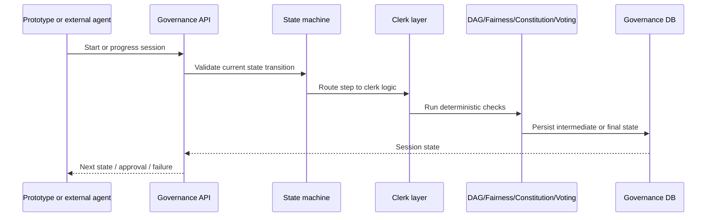

# Flow: Governance Session

## Sequence

## Notes

- The exact route differs by message type, but the stable pattern is state transition -> clerk logic -> validators -> persisted session state.
- When behavior is wrong, inspect whether the bug is in state transition logic or a validator submodule.
