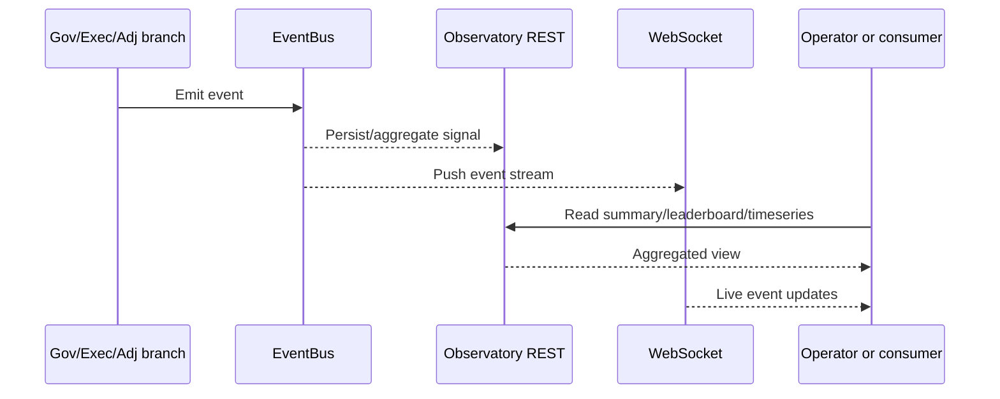

# Flow: Observatory Streaming

## Sequence

## Notes

- REST and websocket consumers share the same underlying observability surface.
- Event bus initialization issues can break both live streams and summary freshness.
