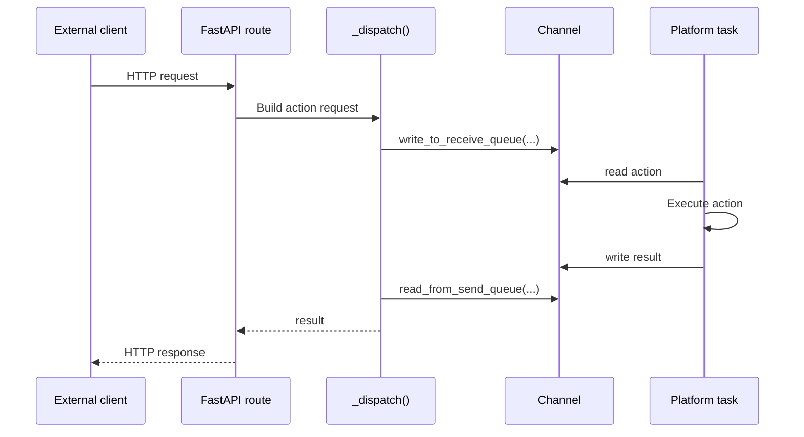

# Flow: Request Dispatch

## Sequence

## Notes

- This is the core request path for platform-backed actions.
- If `_dispatch()` fails, the failure may be in route validation, channel state, or platform logic rather than FastAPI itself.
