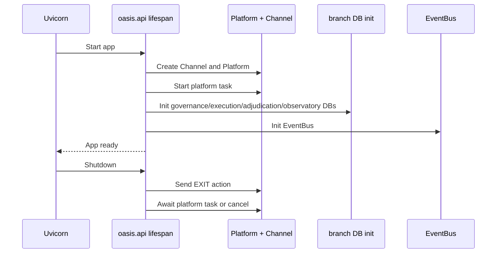

# Flow: Startup And Shutdown

## Sequence

## Notes

- Health may be up only after both platform runtime and branch DB initialization complete.
- Shutdown tries graceful exit first, then falls back to task cancellation.
